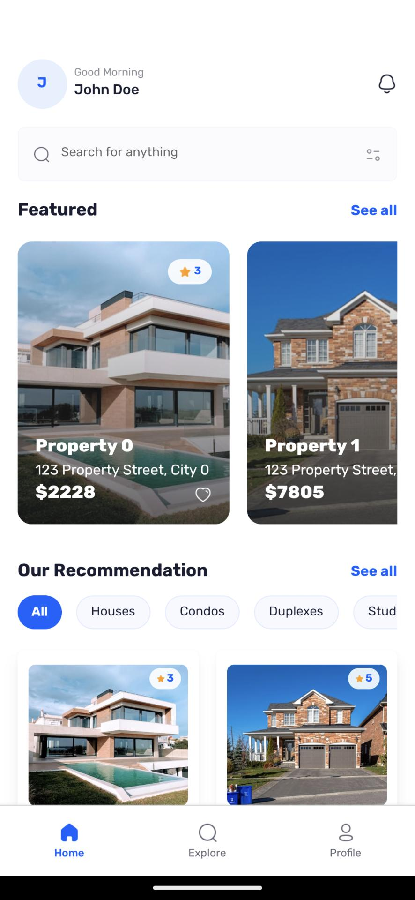
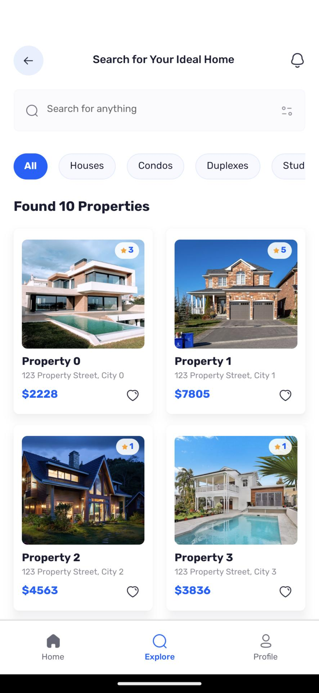
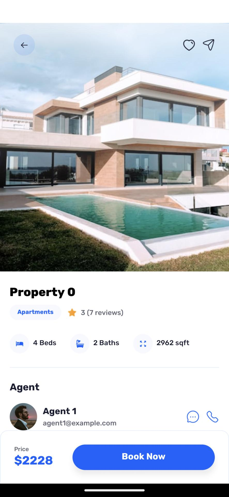
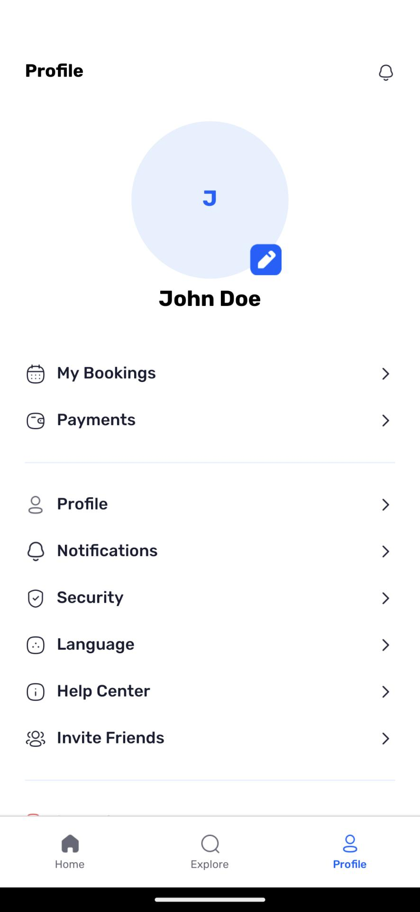
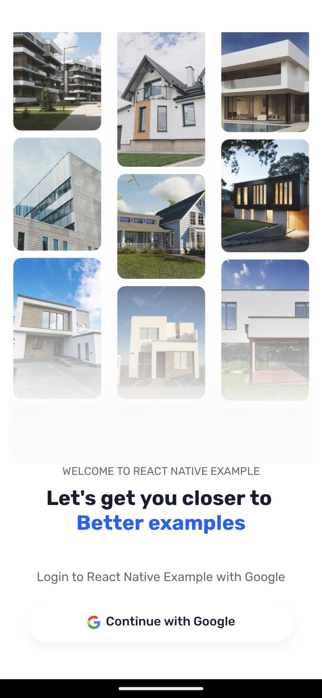

# Real Estate App

A modern React Native application for real estate property browsing.

## 📱 Screenshots

<table style="border-collapse: collapse; border-spacing: 0; padding: 0; text-align: center; font-weight: 700">
  <tr>
    <td style="padding: 0; padding-top: 10px" width="400">
    Home
    </td>
    <td style="padding: 0; padding-top: 10px" width="400">
    Explore
    </td>
  </tr>
  <tr>
    <td style="padding: 0; padding-top: 10px" width="400">
    Property
    </td>
    <td style="padding: 0; padding-top: 10px" width="400">
      Profile
      
    </td>
  </tr>
  <tr>
    <td style="padding: 0; padding-top: 10px" width="400">
      Login
      
    </td>
    <td style="padding: 0" width="400"></td>
  </tr>
</table>

## ✨ Features

- Property search and filtering
- Property details with high-quality images
- User profile customization
- Multiple property types (Houses, Condos, Duplexes)

## 📞 Contact

For any inquiries, please reach out to the development team.
